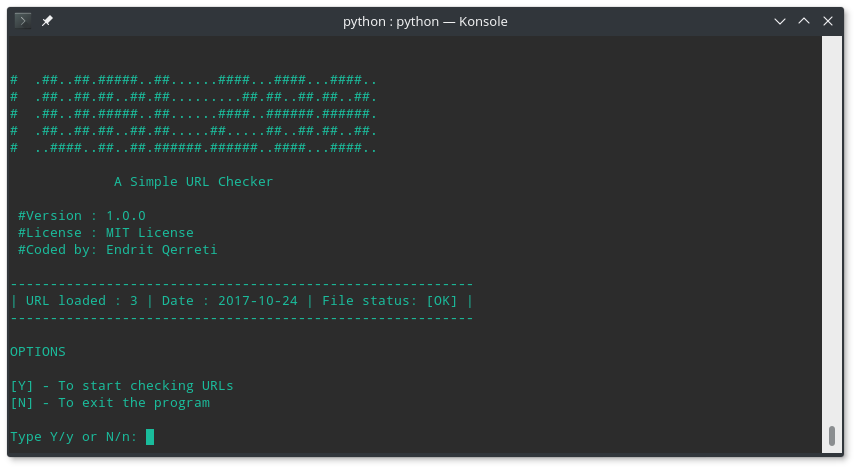
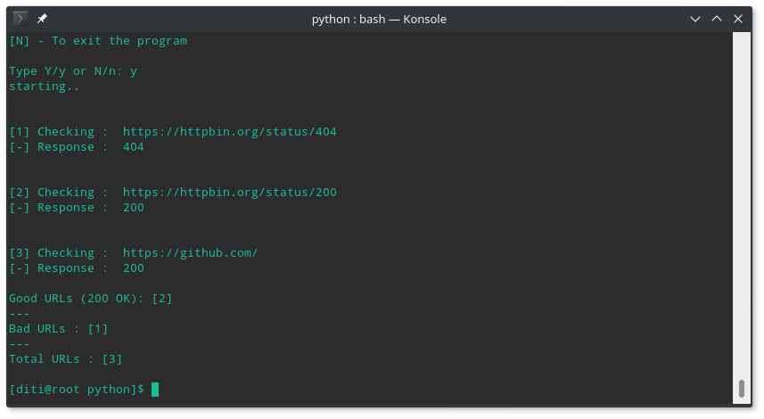

# URL200
URL-200 : A Simple URL checker written in Python. The main function of URL200 is to scan a custom list of urls and save the results into two different .csv files. 

`good_urls.csv` : Only URLs that returns 200OK
`results.csv` : All URLs and response.

## Usage
Note : Root permission required.

  `python url200.py`
  
  
  Make sure all urls in the file "urls.txt" start with http or https, then simply run the app and press y to continue. 
  
  
  ### Screenshots
  
  ### Main
  
  
  ### Scanning 
  
  
  ***

### License 

[MIT](https://github.com/endritqerreti/URL200/blob/master/LICENSE)

(c) [Endrit Qerreti](https://github.com/endritqerreti)
